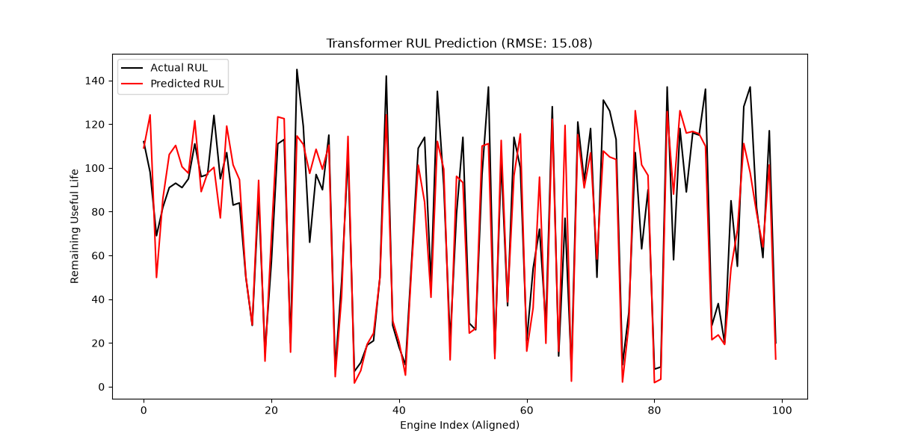
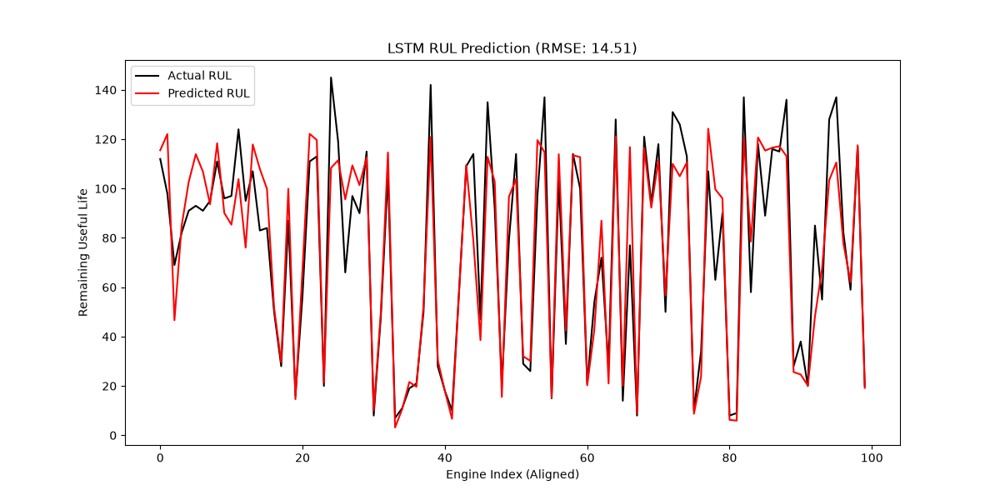

# Transformer vs. LSTM for Remaining Useful Life (RUL) Prediction


Predicting how many operating cycles an aircraft engine has left before failure, from its multivariate sensor stream — a pure-PyTorch Transformer implementation benchmarked head-to-head against an LSTM baseline on the NASA C-MAPSS dataset.

**Why it matters:** predictive maintenance is the difference between replacing an engine *just* before failure and grounding a fleet after one. RUL estimation from raw sensor telemetry is the core ML problem behind it.

## Results (NASA C-MAPSS FD001, 100 test engines)

| Model | Test RMSE (cycles) | Params | Checkpoint |
|---|---|---|---|
| Transformer encoder (ours) | **15.08** | ~590K | `training_logs/transformer_baseline/` |
| LSTM baseline (2×50) | **14.51** | ~34K | `training_logs/lstm_baseline/` |

<p align="center">
  
  
</p>

### Honest findings

On FD001 — the simplest C-MAPSS subset (single operating condition, single fault mode) — **the small LSTM edges out the Transformer**, and the ~0.6 RMSE gap is within single-run variance (seeds are not fixed). This mirrors a known pattern in the RUL literature: attention models tend to pay off on the multi-condition subsets (FD002/FD004) and longer context windows, while compact recurrent models remain very strong on short, regular sequences. Extending this benchmark to FD002–FD004 is the natural next step and the most interesting open question in this repo.

Both numbers were produced end-to-end by the pipeline below on a MacBook Air (CPU) — no copied results.

## Reproduce everything (3 commands per model)

```bash
pip install -r requirements.txt

# 1. Feature engineering (shared): scaling, sequence windowing, artifacts
python feature_engineering.py && python src/generate_features_list.py

# 2a. Transformer: train + evaluate
python train.py --epochs 30 --batch_size 64
python evaluate.py training_logs/transformer_baseline/best_model.pth

# 2b. LSTM baseline: train + evaluate
python train_lstm.py --epochs 30 --batch_size 64
python evaluate_lstm.py training_logs/lstm_baseline/best_model.pth
```

Each evaluation prints the test RMSE and saves a predicted-vs-actual plot.

## How it works

1. **Feature engineering** (`feature_engineering.py`) — drops flat-line sensors, min-max scales the 17 informative channels, applies a piecewise-linear RUL target (capped at 125 cycles, standard practice for C-MAPSS), and windows each engine's history into 30-step sequences → 17,731 training sequences of shape `(30, 17)`.
2. **Models** —
   - *Transformer* (`src/model.py`): input projection → sinusoidal positional encoding → Transformer encoder stack → global average pooling → MLP head.
   - *LSTM baseline* (`train_lstm.py` / `evaluate_lstm.py`): 2-layer LSTM (hidden 50) → last-timestep readout → linear head.
3. **Training** — MSE loss, Adam, best-checkpoint selection on validation loss.
4. **Evaluation** (`evaluate.py`, `evaluate_lstm.py`) — aligns each test engine's final window with its ground-truth RUL, reports RMSE in real cycles, and plots predicted vs. actual.

## Project structure

```plaintext
├── data/                     # C-MAPSS FD001 raw data + generated artifacts
├── src/
│   ├── model.py              # Transformer model definition
│   └── generate_features_list.py
├── assets/                   # Result plots embedded above
├── feature_engineering.py    # Scaling, RUL target, sequence windowing
├── train.py / evaluate.py            # Transformer pipeline
├── train_lstm.py / evaluate_lstm.py  # LSTM baseline pipeline
├── run_pipeline.sh           # End-to-end runner
└── requirements.txt
```

## Dataset

[NASA C-MAPSS](https://www.nasa.gov/content/prognostics-center-of-excellence-data-set-repository) turbofan degradation simulation, subset FD001: 100 training engines run to failure, 100 test engines truncated pre-failure with ground-truth RUL labels.

## License

MIT
